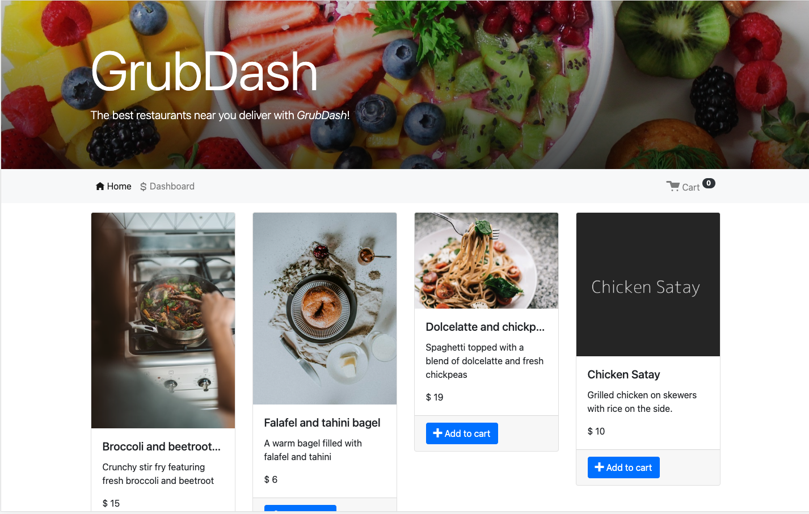
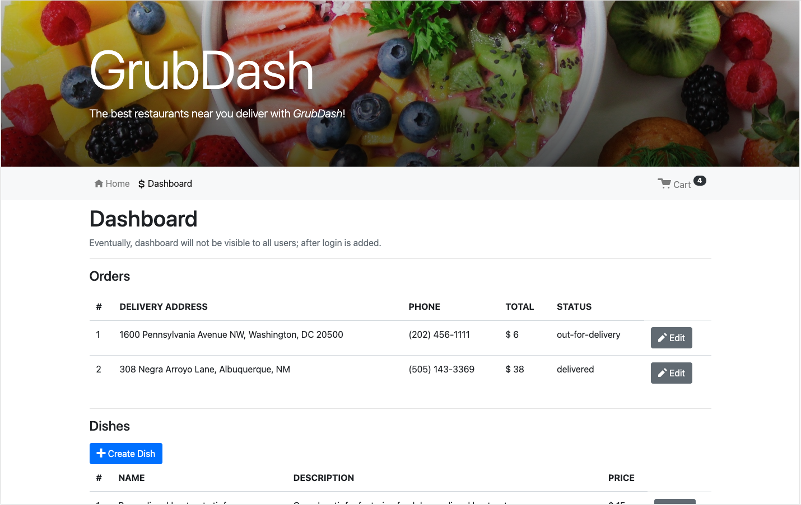

# GrubDash Backend RESTFul API

GrubDash is a fictional company that operates an online food ordering and food delivery platform.

This project uses a RESTful API, custom validation functions, route handlers, and specific API endpoints. The Front-end portion is located here: [Frontend Git Repo](https://github.com/kwilkinz/grubDash-frontend).

## Home Page:

---

## Dashboard:

### Technology:

- RESTful API, Node.js, Express, Nodemon, Jest, Supertest.

### API Documentation:

- All requests return JSON response. All post requests require application/json body and return JSON response.
